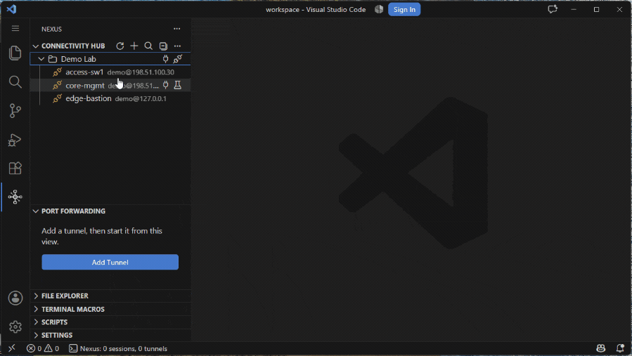

# Nexus Terminal

A full SSH + serial + port-forwarding client inside VS Code — without Remote-SSH's 300MB server payload on the box.

[](https://marketplace.visualstudio.com/items?itemName=sentriflow.vscode-nexterminal)
[](https://open-vsx.org/extension/sentriflow/vscode-nexterminal)
[](LICENSE)
[](https://buymeacoffee.com/evgeny_danilchenko)

- **Replaces PuTTY + MobaXterm + SecureCRT + TeraTerm** — SSH, serial consoles, local shells, port forwarding, and SFTP live in one VS Code sidebar instead of four separate windows.
- **Unlike Remote-SSH, nothing is installed on the remote.** It's a pure client: no `vscode-server` unpacked into the target, no node process running on the far end. That matters when the far end is a Cisco switch, a bastion you only get a shell on, or a change-controlled box where you can't drop an agent.
- **Bring your existing connections** — import session profiles straight from MobaXterm `.ini` and SecureCRT XML exports, folder hierarchy preserved, so switching costs you minutes, not a weekend.
- **Onboard a whole rack in one paste** — feed it a CSV export or a plain list of hostnames and it creates the connections in bulk, with folders, ports, and usernames picked up from the columns. Duplicates are skipped and unparsable lines are reported with their line numbers instead of failing the batch.
- **Edit root-owned files without dropping to a shell** — save `/etc/*` over SFTP with `sudo`, writing through the file's existing inode so owner, mode, and ACLs are preserved. Your sudo password goes to the SSH channel's stdin only: never to disk, never to secret storage, never to a log.

<!-- TODO: record GIF — jump-host A→B→C chain. ~15s, loopable. -->


## Who it's for

- **Network and infra engineers** on Cisco, Juniper, and embedded gear — multi-hop jump-host chaining (A → B → C) and a per-server legacy KEX/cipher toggle keep you connected to old IOS boxes that modern clients refuse.
- **Embedded and firmware developers** on serial consoles — Smart Follow rides through Windows COM-port renumbering, reconnecting only to the device you already approved instead of dropping the session.
- **Homelab and self-hosters** — one sidebar for every box, tunnel, and serial cable, with expect/send auto-trigger macros and a JavaScript scripting engine for repeatable tasks.
- **VSCodium and Open VSX users** — full SSH that Remote-SSH (proprietary, Marketplace-only) can't give you, plus 2FA keyboard-interactive auth and encrypted config backup.

## Install

- **VS Code Marketplace** — open the Extensions view (`Ctrl+Shift+X`), search **Nexus Terminal**, and click Install. Listing: https://marketplace.visualstudio.com/items?itemName=sentriflow.vscode-nexterminal
- **Open VSX** (VSCodium, Theia, Gitpod) — search **Nexus Terminal** in the Extensions view, or install the VSIX directly. Listing: https://open-vsx.org/extension/sentriflow/vscode-nexterminal

## Features

- **SSH Terminal Sessions** — Connect to remote servers with password, private key, or SSH agent authentication. Two-factor authentication (keyboard-interactive) is fully supported — passwords auto-fill while verification codes are prompted separately. Credentials are cached securely via VS Code SecretStorage with silent re-auth. Per-server legacy algorithm toggle for older devices (Cisco IOS, embedded systems).
- **SSH Key Deployment** — Right-click any server and select "Deploy SSH Key" to automate key-based authentication setup. Discovers existing local keys or generates new ed25519 key pairs, deploys the public key to the remote `authorized_keys`, and optionally converts the server profile to key auth. Cross-platform (Windows, macOS, Linux).
- **SSH Host Key Verification** — Trust-on-first-use (TOFU) model stores host keys on first connection and alerts if a key changes (potential MITM). Configurable via `nexus.ssh.trustNewHosts`.
- **Auth Profiles** — Define reusable credential sets (password, private key, or SSH agent) and apply them to individual servers or entire folders in bulk. Manage profiles from a dedicated editor panel accessible via the Settings tree or context menu.
- **Proxy Support** — Route SSH connections through intermediaries when direct access isn't available. Three proxy types are supported per server:
  - **SSH Jump Host** — Select another configured server as a bastion/jump host (ProxyJump equivalent). Supports multi-hop chaining (A → B → C) with full auth reuse.
  - **SOCKS5 Proxy** — Connect through a SOCKS5 proxy server with optional username/password authentication.
  - **HTTP CONNECT Proxy** — Connect through an HTTP proxy using the CONNECT method, common in corporate environments.
- **SFTP File Explorer** — Browse, download, and manage remote files on connected servers. Drag-and-drop support for moving files between directories. One SSH profile can be set to open the File Explorer automatically after normal Connect when the view is not already showing that server.
- **Directory Sync (Follow Terminal Directory)** — Keeps the File Explorer pointed at whatever directory your SSH terminal is actually in, instead of wherever you last browsed. It's continuous, not a one-off jump, on any shell that announces its own directory (`fish`, `starship`, or bash/zsh with one added line — see below); everything else gets a manual **Go to Terminal Directory** action. Nexus never types anything into a session to make this work.
- **Serial Terminal Sessions** — Connect to serial ports (COM/ttyUSB) with configurable baud rate, data bits, parity, stop bits, and RTS/CTS flow control. Supports break signal and XON passthrough. Includes **Smart Follow** mode for Windows COM-port renumbering: it retries the preferred port, silently reconnects only to the previously approved device when metadata matches, prompts before switching to unfamiliar replacement ports, updates the saved preferred port after a successful move, and keeps the terminal open while waiting or stopped instead of tearing the tab down on serial errors. Runs in an isolated sidecar process for crash safety.
- **Local Shell Profiles** — Save named local terminal profiles and open one or more local shell sessions from the Connectivity Hub. Use a launchable VS Code terminal profile from the profile dropdown, including common resolved PowerShell, Git Bash, Command Prompt, and WSL profiles when available, or choose **Custom Shell** to set an explicit shell path, one argument per line, a working directory, and an optional startup command. Manual macros, auto-trigger macros, and Nexus scripts work with Local Shell sessions.
- **Port Forwarding (TCP Tunnels)** — Three tunnel modes:
  - **Local (-L)** — Forward a local port to a remote host through SSH.
  - **Reverse (-R)** — Forward a remote port back to a local target.
  - **Dynamic SOCKS5 (-D)** — Run a local SOCKS5 proxy that routes traffic to any destination through SSH.

  All modes support configurable local bind addresses (localhost, LAN, or all interfaces), auto-start/auto-stop with server connections, live traffic counters, and a browser URL shortcut for quick access.
- **SSH Connection Multiplexing** — Share SSH connections across terminals, tunnels, and SFTP for the same server. Reduces connection overhead with automatic ref-counting and configurable idle timeout. Per-server toggle lets you disable multiplexing for devices that don't support multiple channels (e.g. Cisco). Automatic fallback to standalone connections handles channel failures transparently.
- **Connectivity Hub** — Sidebar tree view showing all servers, serial devices, and local shell profiles, organized into nested folders. Built-in filter to quickly search by name. Drag and drop to rearrange profiles, move between folders, or assign tunnels to servers. Active SSH and serial sessions highlight unread terminal activity in the tree and prepend `●` to the terminal tab title until you focus that terminal again.
- **Terminal Appearance** — Customize terminal font family, size, and weight. Import color schemes from MobaXterm INI files or configure custom themes with live preview.
- **Terminal Highlighting** — Configurable regex-based pattern highlighting for SSH, serial, and Local Shell terminal output. 20+ built-in rules detect errors, warnings, status keywords, IP/MAC addresses, UUIDs, URLs, interface counters and more with inline ANSI colouring while respecting existing terminal colours. Includes a visual Rule Editor with live preview, staged Apply/Cancel, rule ordering, custom SGR foreground codes, regex safety checks, and one-click reset to defaults.
- **Terminal Macros** — Define reusable text sequences and send them to the active terminal with one click or keyboard shortcut. Assign any macro a custom keybinding from 108 combinations across three modifier groups: `Alt`, `Alt+Shift`, and `Ctrl+Shift` with A-Z or 0-9 keys. Macros without a keybinding are accessible via `Alt+S` quick-pick. Includes a Macro Editor panel with multiline editing, secret macro support, inline keybinding assignment, and Macros-view actions to copy or paste secret values via the system clipboard. Clipboard copies place the value in the OS clipboard as plain text. **Auto-trigger (expect/send)**: add a `triggerPattern` regex to any macro — when terminal output matches, the macro text is sent automatically. Existing macros default to all-terminal matching for compatibility; new macros can be scoped to the active terminal or a matching profile, which is recommended for secret prompts. `triggerCooldown` prevents echo loops, `triggerInterval` enables prompt-gated polling macros, and macros can optionally start with auto-trigger paused until you resume them from the Macros view. Pause/resume, interval ownership, and cooldown state all follow the macro itself, so reordering or deleting other macros never moves that state onto the wrong one. See the [macro guide](docs/macros.md) for step-by-step setup, trigger scopes, cooldowns, intervals, and regex examples.
- **Macro Variables** — Declare named variables on a macro (label, default, mask-input, remember) in the Macro Editor and reference them in its text as `$name` or `${name}`; running the macro walks a step-by-step prompt (with Back) for each variable actually used, then sends the filled-in command to the terminal you invoked it from — even if you switch tabs while the prompts are open. A placeholder for a name you never declared is sent through unchanged rather than blocking the macro. Variables and auto-trigger can't be combined on the same macro — prompting needs a foreground input box, which a background pattern match can't safely open. See the [macro guide](docs/macros.md) for the full variable reference.
- **Keyboard Passthrough** — Optionally pass `Ctrl+` key combinations (e.g. `Ctrl+B`, `Ctrl+N`) directly to the terminal for applications like vim, nano, and htop. Configurable per-key with 10 supported combinations.
- **Session Transcript Logging** — Automatically log clean terminal output (ANSI codes stripped) to files with configurable rotation. Per-profile toggle.
- **Terminal Tab Commands** — Right-click any Nexus terminal tab for three PuTTY-style commands: *Reset Terminal* (clears the visible screen while preserving scrollback), *Clear Scrollback* (clears visible and captured transcript together), and *Copy All to Clipboard* (ANSI-stripped transcript of the session). After a session disconnects, Reset and Clear grey out; Copy All stays enabled so a run can always be captured for a ticket or chat.
- **Settings Panel** — View and edit extension settings in a dedicated webview panel with grouped categories, terminal-adjacent actions, validation, and host-confirmed auto-save.
- **Configuration Export/Import** — Full encrypted backup with master password protection, or sanitized share export (credentials stripped, IDs remapped). Proxy configurations are preserved across backup and restore.
- **Import from MobaXterm / SecureCRT** — Migrate SSH session profiles directly from MobaXterm INI files or SecureCRT XML exports and session directories. Folder hierarchy is preserved.
- **Scripts** — Author `.js` automation scripts under `.nexus/scripts/` (or the folder of your choice via *Nexus Settings → Scripts → Scripts Folder*, which exposes a native folder picker; works with or without an open workspace — when none is open, scripts live in the extension's global storage) and run them against any active SSH, Serial, or Local Shell session. Scripts use an async expect/send API (`waitFor`, `expect`, `waitAny`, `send`, `sendLine`, `sendKey`, `poll`, `prompt`, `confirm`, `alert`, `sleep`, `log`) with IntelliSense auto-seeded on first run. Each script runs in an isolated `worker_threads` Worker so runaway loops can be stopped in &lt;100 ms. Macros on the script's session are suspended automatically (configurable via `nexus.scripts.macroPolicy` and the per-script `@allow-macros` header); macros on unrelated sessions keep firing normally. Minimal example:
  ```js
  /**
   * @nexus-script
   * @name Quick login check
   * @target-type ssh
   */
  await expect(/[$#] $/, { timeout: 10_000 });
  await sendLine("uname -a");
  const out = await expect(/[$#] $/);
  log.info("kernel:", out.before.trim());
  ```
  See the **[full scripting guide](docs/scripting.md)** for the complete API reference, header fields, match-window semantics, error-handling patterns, macro coordination, and [`examples/scripts/`](examples/scripts/) for seven runnable scripts demonstrating `if` / `while` / `for` loops, retries, polling, user interaction, and complete multi-step procedures.
- **Folders for Macros and Scripts** — Group Terminal Macros and Nexus Scripts into folders, the same way servers and serial profiles are organized in the Connectivity Hub. Create a macro folder explicitly (New Folder) or by moving/dragging a macro into it; script folders are just directories under the scripts folder — create one with New Folder, or give New Script a `folder/name` path and Nexus creates the folder for you. A folder is yours to create and persists even while empty; removing a macro folder re-parents its macros instead of deleting them. See the [macro guide](docs/macros.md#organising-macros-into-folders) and the [scripting guide](docs/scripting.md#organising-scripts-into-folders).
- **Web Extension Fallback** — Graceful degradation in browser-based VS Code (SSH/serial features require desktop runtime).

## Getting Started

Nexus Terminal is available from both the VS Code Marketplace and Open VSX registries.

### First Use Flow

1. Open the **Nexus** sidebar and create a profile with `Nexus: Add Profile`, `Nexus: Add Server`, `Nexus: Add Serial Profile`, or `Nexus: Add Local Shell Profile`.
2. Select **Connect** / **Open Local Shell** on the profile to open an SSH, Serial, or Local Shell terminal.
3. For SSH profiles, open **File Explorer** and run **Browse Files** to choose the connected profile and browse SFTP files.
4. Open **Port Forwarding**, add a tunnel with `Nexus: Add Tunnel`, assign an SSH server, then select **Start**.
5. Create repeatable terminal input with `Nexus: Add Blank Macro` or **Add Macro From Template**; create longer automation with `Nexus: New Nexus Script`.
6. Open **Settings** and use **Encrypted Backup** to save a password-protected backup, or **Export for Sharing** to create a sanitized export without secrets.

### Install from VS Code Marketplace

1. Open VS Code and go to the Extensions view (`Ctrl+Shift+X`)
2. Search for **Nexus Terminal**
3. Select the listing from the **Visual Studio Marketplace**
4. Click **Install**
5. Open the **Nexus** sidebar (activity bar icon)

### Install from Open VSX

- Listing URL: https://open-vsx.org/extension/sentriflow/vscode-nexterminal

1. Open your Open VSX-compatible editor (for example VSCodium, Eclipse Theia, or Gitpod).
2. Go to the Extensions view and search for **Nexus Terminal** in the Open VSX registry, then click **Install**.
3. Or install directly from a downloaded VSIX: `Extensions` > `...` > `Install from VSIX...` and select the package file.
4. Open the **Nexus** sidebar (activity bar icon).

### Install from VSIX

1. Download the `.vsix` from [GitHub Releases](https://github.com/evdanil/vscode-NexTerminal/releases)
2. In VS Code or Open VSX-compatible editors: `Extensions` > `...` > `Install from VSIX...`
3. Open the **Nexus** sidebar (activity bar icon)

### Add a Server

1. Click `+` in the Connectivity Hub title bar, or run `Nexus: Add Server` from the command palette
2. Enter host, port, username, and authentication details (password, private key, or SSH agent)
3. Optionally configure a proxy (SSH jump host, SOCKS5, or HTTP CONNECT) under the Proxy section
4. Right-click the server and select **Connect** to open a terminal session
5. To set up key-based auth: right-click the server → **Deploy SSH Key** → select or generate a key → the public key is deployed automatically

### Connect Through a Proxy

If your target server is behind a firewall or bastion host:

1. **SSH Jump Host** — First add the bastion server as a regular server profile, then edit the target server and set its proxy to "SSH Jump Host", selecting the bastion from the dropdown. Multi-hop chains (A → B → C) work automatically.
2. **SOCKS5 / HTTP CONNECT** — Edit the target server and set its proxy type, entering the proxy host, port, and optional credentials. Proxy passwords are stored securely in VS Code SecretStorage.

### Add a Serial Device

1. Click the serial icon in the Connectivity Hub title bar, or run `Nexus: Add Serial Profile`
2. Use **Scan Serial Ports** to discover available ports
3. Choose **Standard** or **Smart Follow** connection mode, then configure baud rate, data bits, parity, and stop bits
4. Right-click the profile and select **Connect**
5. Smart Follow profiles coexist with other serial sessions on different ports, print status updates in the terminal when they switch ports or wait for reattach, silently reconnect only to the previously approved device, and prompt before switching to unfamiliar free ports. Connecting any serial profile is blocked only when the target port is already held by another Nexus serial session.

### Add a Local Shell Profile

1. Run `Nexus: Add Local Shell Profile`, or use `Nexus: Add Profile` and select **Local Shell Profile**
2. Name the profile for the workflow you want to save, for example `PowerShell Admin`, `WSL Ubuntu`, or `Project Shell`
3. Choose **VS Code Terminal Profile** to pick a launchable VS Code terminal profile. Nexus lists explicit-path profiles plus common resolved profiles such as PowerShell, Git Bash, Command Prompt, and detected WSL distros when their executable can be found.
4. Choose **Custom Shell** when you need a path, command, or arguments Nexus cannot infer. For WSL on Windows, use `C:\Windows\System32\wsl.exe`; add arguments one per line when you need a distro or startup option, for example `-d` and `Ubuntu`
5. Optionally set a working directory and startup command, then save the profile
6. Right-click the profile and select **Open Local Shell**. You can open multiple sessions from the same saved Local Shell profile.
7. Auto-trigger macros can match Local Shell output. Existing macros scoped to **All terminals** will also apply to Local Shell sessions; use profile-scoped macros for shell-specific prompts.

### Macro Variables

A macro can prompt you for input every time it runs, instead of sending fixed text. Open a macro in the Macro Editor and add one or more entries under **Variables**: a name, an optional label (the prompt text shown in the input box), an optional default, **Mask input (never stored)** for secrets like passwords, and whether to remember the last value entered in the current VS Code window.

Reference a declared variable in the macro's text as `$name` or `${name}` — both forms work once `name` is declared. A placeholder whose name was never declared as a variable is sent to the terminal exactly as written, so a typo in a variable name doesn't block the macro; watch the live hints under the Text field in the Macro Editor to catch it.

Running the macro opens one input box per declared-and-used variable, in declaration order, with a **Back** button to return to the previous prompt (not shown on the first one). Pressing Esc or closing the box at any step cancels the whole run — nothing is sent. Once every prompt is answered, Nexus sends the filled-in text to the terminal you invoked the macro from, even if you've since switched to a different terminal tab.

The **Prompted command** template (Add Macro From Template) builds this worked example — the feature's original use case:

```
Text:      ipmitool -I lanplus -H $host -U $username -P $password sol activate
Variables: host (Host), username (Username), password (Password, masked)
```

Running it prompts for the host, then the username, then the password (masked, never remembered), then sends the completed `ipmitool` command to your terminal.

A macro can prompt for input, or auto-trigger from terminal output — not both. If a macro somehow ends up with both, Nexus treats it as a plain, non-auto-triggering macro instead of running either behavior partially.

See the [macro guide](docs/macros.md) for the full variable syntax table, the `'${password}'` quoting idiom, and the `HISTCONTROL=ignorespace` trick for keeping a value out of the remote shell's history.

### Organizing Macros and Scripts into Folders

Both the Macros view and the Scripts view group their contents into folders, matching the Connectivity Hub. Folders are yours to create — an empty folder stays until you remove it.

For macros, folders are a display grouping: use **New Folder** in the Macros view title bar to create one, then drag a macro onto it (or right-click a macro → **Move to Folder**) to move it in. Running **Move to Folder** from the Command Palette with nothing selected opens a multi-select quick pick first, so sorting a flat pile of macros into folders is a bulk operation rather than one drag per macro. Removing a folder re-parents its macros to the parent folder instead of deleting them, and reordering with **Move Up** / **Move Down** only ever swaps a macro with its neighbor in the *same* folder.

For scripts, a folder is a real directory under your configured scripts folder (`nexus.scripts.path`, default `.nexus/scripts`). Use **New Folder** in the Scripts view, or give **New Script** a path like `cisco/backup` and Nexus creates `cisco/` for you if it doesn't exist yet. A folder's right-click menu repeats New Script and New Folder scoped to that folder, plus **Reveal in Explorer**. The Scripts view scans up to 10 folder levels deep and up to 500 directories/non-script files before stopping, to keep a misconfigured scripts path from hanging the sidebar; if that happens, a row pinned at the top of the view links straight to the setting.

Both views validate folder paths the same way: `.` and `..` segments are rejected, and a `\` is rejected with a message telling you to use `/` — a path like `../../home/you/something` can never write or move something outside where it belongs.

### Set Up Port Forwarding

1. Switch to the **Port Forwarding** section in the sidebar
2. Click `+` to add a tunnel profile and choose the type:
   - **Local Forward (-L)**: specify local port, remote host, and remote port
   - **Reverse Forward (-R)**: specify remote bind address/port and local target host/port
   - **Dynamic SOCKS5 (-D)**: specify local port (default 1080) — routes traffic to any destination through SSH
3. Assign an SSH server to the tunnel, or leave it unassigned to choose at start time
4. Right-click the tunnel and select **Start**

You can also drag a tunnel profile onto a server in the Connectivity Hub to start it immediately.

### Browse Remote Files

1. Connect to an SSH server
2. Open the **File Explorer** section in the Nexus sidebar
3. Click the server icon to set it as the active SFTP target
4. Browse, download, or drag files between remote directories

In an SSH profile's advanced options, enable **Open File Explorer on first connection** to start SFTP automatically after normal Connect when the File Explorer is not already showing that server. Saving it checked disables it on any other SSH profile, and it does not run when that profile is used as a jump host, tunnel connection, group connect item, or script-started connection.

#### Save as Root

SFTP writes as the logged-in SSH user, so editing a root-owned file normally fails. If your SSH user has sudo rights on the remote host, Nexus can save it anyway:

- **Reactive**: edit and save a root-owned file as usual. If the write is denied, Nexus offers to retry with `sudo`. Declining suppresses the offer for that file until you close its editor tab or explicitly choose **Edit as Root (sudo)**.
- **Proactive**: right-click a file in the File Explorer and choose **Edit as Root (sudo)** to mark it editable up front — needed for files with no write bits at all (e.g. `0444`), which VS Code otherwise blocks from editing before the save is ever attempted. This only helps with *writes*: elevated reads are not supported, so a file you can't even read as your SSH user (e.g. `0440 root:root` on `/etc/sudoers`) still fails to open, Edit as Root notwithstanding.

Elevation covers saving file *contents* only — deleting, renaming, and creating directories are not elevated, because those need write access to the **parent directory** rather than to the file. So you can save a new file into a root-owned directory and then find you can't remove it from the File Explorer; do that from a terminal on the host. Extending elevation to those operations is tracked in [#32](https://github.com/evdanil/vscode-NexTerminal/issues/32).

The file is staged to a temporary path over SFTP and then moved into place with `sudo` over an SSH exec channel. Your sudo password (only asked if the account needs one) is piped directly to that channel — it is never written to disk, VS Code's secret storage, or any log. By default the password isn't kept between saves; enable `nexus.sftp.sudo.rememberPasswordForSession` to keep it in memory until that server disconnects or the window closes. Either way, the remote host's own sudo credential timestamp (typically ~5 minutes) can let consecutive saves skip the password prompt regardless of this setting. A short grace window (30 seconds) after you type the password also covers an immediately-following elevated write to the same server — such as VS Code's own Save As, which issues two writes for one save — without prompting twice.

For an existing file, the write goes through the file's own inode, so its owner, mode, ACLs, and hard links are preserved exactly. A brand-new file — or an existing one recreated because it vanished remotely between open and save (log rotation, a concurrent delete) — is created using the mode last observed for it, or `644` if none was ever observed. That restoration is read/write bits only — a recreated file never comes back with execute or setuid/setgid/sticky bits, which can be narrowed but never restored. **The write is not atomic** — a disk-full condition or a dropped connection partway through can leave the target partially written with no backup, so if a save fails, keep the editor open and retry rather than closing it. Sudoers policies requiring a TTY (`requiretty`) are not supported over this path — a plain-language error explains that up front, along with how to work around it. The install writes through a shell redirect (`cat < temp > target`), which follows symlinks and does not check the target's type first: if another local, non-root account on the remote host can write to the target's parent directory, it can swap the target for a symlink between your open and your save, and the elevated write lands root-owned content wherever that link points — the same exposure as the common `sudo tee /path` idiom. Elevated saves can be turned off entirely with `nexus.sftp.sudo.enabled`.

Elevation depends on the SSH account actually having sudo rights on the remote host (sudoers membership, or a group like `wheel`/`sudo`) — the password Nexus asks for is normally **your own** login password, the same one a `sudo` prompt at a real terminal would ask for. If you're not in sudoers but happen to know the root password, elevation can't use it: sudo authenticates the invoking user, not root, so the root password isn't accepted in its place. The practical workaround is to add a second Nexus server profile that logs in **as root** over SSH and edit the file directly through that connection — only possible if the remote host's SSH server permits root login. Elevating with the root password via `su` instead of `sudo` is not supported and isn't planned: unlike `sudo -S`, `su` on Linux reads its password from `/dev/tty` rather than stdin, and Nexus has no PTY channel available to drive that prompt. One host-configuration wrinkle worth knowing: if the remote sudoers file sets `Defaults rootpw` (or `targetpw`), sudo actually wants **root's** password instead of yours — a password rejected on such a host isn't necessarily wrong, just the wrong *kind*, and the retry prompt calls this out.

### Directory Sync (Follow Terminal Directory)

The File Explorer can track whichever SSH terminal you're focused on, so it moves with that terminal's current directory instead of sitting wherever you last navigated.

This is **continuous sync** — not a one-off jump — for any shell that announces its own directory. `fish` (≥ 3.x) does this unconditionally, and prompt frameworks like `starship` do too, using the same `OSC 7` escape sequence Nexus already reads out of the terminal's own output. Plain bash and zsh don't announce it by default, but one snippet each fixes that for good:

```bash
# ~/.bashrc — let Nexus follow this shell's directory
PROMPT_COMMAND='printf "\033]7;file://%s%s\033\\" "$HOSTNAME" "$PWD"'"${PROMPT_COMMAND:+; $PROMPT_COMMAND}"
```

```zsh
# ~/.zshrc — let Nexus follow this shell's directory
__nexus_osc7() { printf '\033]7;file://%s%s\033\\' "${HOST}" "$PWD"; }
precmd_functions+=(__nexus_osc7)
```

(zsh sets `$HOST` automatically — `$HOSTNAME` is frequently unset there, unlike in bash.) Add either once and that shell reports its directory continuously from then on — no waiting for a future Nexus release.

For anything that isn't a POSIX shell — Cisco IOS, Juniper, FortiOS, or any other device that will never emit that escape sequence — run **Go to Terminal Directory** to jump the File Explorer to your terminal's current directory on demand, using a best-effort read of the visible prompt.

Turn continuous following on or off from the toggle at the left of the File Explorer title bar, or from the right-click menu on the `.` row that shows your current directory — never from Settings. Turning it on jumps immediately to the focused terminal's already-known directory if one is on record and the explorer is idle and visible, rather than waiting for the next `cd` or focus change. Navigating manually (Go to Path, Go Home, or `..`) pauses following rather than fighting it; one click on **Resume Following Terminal Directory** jumps straight back to the terminal's directory.

If you turn following on for a terminal that hasn't reported a directory yet, Nexus tells you right away instead of leaving the toggle looking broken: **Show Me How** drops the rc one-liner into the Nexus Directory Sync output channel, and **Go to Terminal Directory** jumps there manually in the meantime. That notice shows once per server per window.

**Nexus never types anything into your session to make this work, in this release.** Every part of this feature only reads what the shell already sends — it either volunteers its own directory, or you ask for it explicitly with Go to Terminal Directory.

### Open a profile from the command line

Nexus registers a `vscode://` URI handler so you can open any saved profile — **SSH, Serial, or Local Shell** — from a terminal, a script, a browser link, or a CI job. The profile type is detected automatically from the name (or id) you give, and Nexus runs the matching connect action.

**URI forms:**

```
vscode://sentriflow.vscode-nexterminal/<name>            # open the named profile (SSH / Serial / Local Shell)
vscode://sentriflow.vscode-nexterminal/<name>?sftp       # SSH only: connect + open File Explorer (SFTP)
vscode://sentriflow.vscode-nexterminal/<name>?id=<uuid>  # use profile id instead of name
```

- `<name>` is case-insensitive and matched across all profile types; the first match is used when multiple profiles share a name (a warning suggests `?id=` to disambiguate).
- `?id=<uuid>` overrides the name for unambiguous lookup. Find a profile's id in **Nexus → Settings → Export Configuration**.
- `?sftp` is **SSH-only** — it opens the SSH terminal **and** the File Explorer for SFTP browsing in one click. Requesting `?sftp` on a Serial or Local Shell profile shows an error.

**Open from the command line:**

```bash
code --open-url "vscode://sentriflow.vscode-nexterminal/Production"
```

> **Note:** Use `--open-url`, not `--file-uri` or `--folder-uri` — those open local files/folders and do not route to the extension's URI handler.

**Shell alias (bash / zsh):**

```bash
nexterm() { code --open-url "vscode://sentriflow.vscode-nexterminal/$1"; }
# Usage (works for SSH, Serial, and Local Shell profiles by name):
nexterm Production
nexterm "My Server"
nexterm "Lab Console"      # a saved Serial profile
nexterm Production?sftp     # SSH only
```

Add this to your `~/.bashrc` or `~/.zshrc` to make it permanent.

**PowerShell function:**

```powershell
function nexterm($p) { code --open-url "vscode://sentriflow.vscode-nexterminal/$p" }
# Usage:
nexterm Production
nexterm "My Server"
nexterm "Production?sftp"
```

Add this to your PowerShell profile (`$PROFILE`) to make it permanent.

### Export / Import Configuration

- **Encrypted Backup**: Run `Nexus: Export Backup` to create a master-password-protected backup including all profiles, settings, saved credentials, the user `.ssh` folder, and the configured Nexus scripts folder
- **Share Export**: Run `Nexus: Export Configuration` to create a sanitized export safe for sharing (credentials stripped, learned hardware identifiers removed, IDs remapped)
- **Import**: Run `Nexus: Import…` — also reachable from the Command Center's `...` overflow menu, the Command Center welcome view, and the Data Management section of Settings. It asks what you're importing, then opens the matching picker:
  - **Paste Host List from Clipboard** / **Host List File…** — a CSV export, a device inventory, or a plain hostname list
  - **MobaXterm INI File…** — sessions from a MobaXterm `.ini` bookmarks export
  - **SecureCRT XML Export…** / **SecureCRT Sessions Folder…** — sessions from SecureCRT
  - **Nexus Export File…** — an encrypted backup or a shared config (`.json`). Merge skips existing local `.ssh` / script files; Replace overwrites files present in the backup but does not delete extra local files.

  If the file you picked doesn't match what you told the picker — say, you chose "Host List File…" but selected a MobaXterm export — Nexus names the mismatch and offers a one-click button to re-import it as the format it actually looks like, instead of a dead end.

  `Nexus: Import from MobaXterm`, `Nexus: Import from SecureCRT`, and `Nexus: Import Servers from List (CSV/Text)` remain available in the command palette as direct shortcuts into those same pickers, for anyone who already knows exactly what they're importing.

#### Import from MobaXterm or SecureCRT

Power users migrating from other SSH clients can import their connection profiles directly:

- **MobaXterm**: choose **MobaXterm INI File…** and select your MobaXterm `.ini` configuration file. SSH sessions are imported with their folder organization preserved.
- **SecureCRT**: choose **SecureCRT XML Export…** or **SecureCRT Sessions Folder…** and select the corresponding export file or `Sessions/` directory. SSH sessions are imported with their hierarchy as folder groups.

Both importers extract hostname, port, and username from each SSH session. Non-SSH sessions (RDP, Telnet, etc.) are skipped. Imported servers default to password authentication.

#### Import a device list (CSV / text)

For everyone else — a spreadsheet export, a device inventory, or just a list of hostnames — choose **Paste Host List from Clipboard** or **Host List File…** (`.csv`, `.txt`, `.tsv`, up to 2 MB and 5,000 rows; anything beyond the row cap is reported, not silently dropped).

Accepted formats:

- **A header row** naming columns in any order: `host`/`hostname`/`address`/`ip`, `name`/`label`/`device`, `user`/`username`, `port`, `folder`/`group`/`site`.
- **No header**, positional: `host[,name[,username[,port[,folder]]]]` — note the third field is read as a **username**, not a folder. A bare `host,name,folder` list needs a header row (e.g. `host,name,folder`) so the columns are matched by name instead of position.
- **Shorthand** in the host field: `user@host`, `host:port`, `user@host:port`.
- Lines starting with `#` and blank lines are ignored.

```csv
# host, name, user, port, folder
10.0.0.1, core-sw1, netadmin, 22, DC1/Core
10.0.0.2, core-sw2, netadmin, 22, DC1/Core
sw3.lab.example.com
netadmin@sw4.lab.example.com:2022
```

If any row omits a username you're prompted once for a default (pre-filled with your most common existing username). If the list has no folder column of its own you're then prompted for an optional folder prefix, applied to every row. A single confirm dialog then summarizes what's about to happen — how many servers, how many folders will be created, how many rows already exist and will be skipped, how many lines couldn't be parsed — before anything is written; a **Show Skipped Lines** button opens the unparsable rows in a scratch document without importing. Rows that already match an existing server (same host, port, and username — host compared case-insensitively) are skipped and the count is reported. Imported servers always use password authentication — switch to key-based auth afterward via **Edit Server** if needed.

#### Hand-writing an import file

Choosing **Nexus Export File…** also accepts a minimal hand-written JSON file — useful for one connection or a quick script, without going through any other importer:

```json
{
  "version": 2,
  "servers": [
    {
      "id": "8400e8b0-8b3e-4b8a-9b1a-000000000001",
      "name": "core-sw1",
      "host": "10.0.0.1",
      "port": 22,
      "username": "netadmin",
      "authType": "password",
      "isHidden": false,
      "group": "DC1/Core"
    }
  ]
}
```

`name`, `host`, `port`, `username`, `authType`, and `isHidden` are required. `group` is optional (omit it for a top-level server), and so is `id` — Nexus fills one in for you if it's left blank or omitted; it just needs to be unique if you do supply it.

## Development

```bash
npm install
npm run build
npm test
```

To package a VSIX:
```bash
npm run package:vsix
```

## Key Settings

| Setting | Default | Description |
|---------|---------|-------------|
| `nexus.logging.sessionTranscripts` | `true` | Enable session transcript logging |
| `nexus.logging.sessionLogDirectory` | *(extension storage)* | Custom directory for session logs |
| `nexus.logging.maxFileSizeMb` | `10` | Max log file size before rotation |
| `nexus.logging.maxRotatedFiles` | `1` | Number of rotated log files to keep |
| `nexus.ssh.multiplexing.enabled` | `true` | Share SSH connections across terminals, tunnels, and SFTP |
| `nexus.ssh.multiplexing.idleTimeout` | `300` | Seconds to keep idle multiplexed connection alive |
| `nexus.ssh.trustNewHosts` | `true` | Auto-trust host keys on first connection (TOFU); prompt only on key change |
| `nexus.ssh.connectionTimeout` | `60` | SSH connection timeout in seconds |
| `nexus.ssh.keepaliveInterval` | `10` | Interval between SSH keepalive packets in seconds (`0` disables keepalives) |
| `nexus.ssh.keepaliveCountMax` | `3` | Missed keepalive responses before the connection is treated as dead |
| `nexus.ssh.terminalType` | `xterm-256color` | `$TERM` value reported to the remote shell |
| `nexus.ssh.proxyTimeout` | `60` | Proxy handshake timeout for SOCKS5 and HTTP CONNECT proxies |
| `nexus.tunnel.defaultConnectionMode` | `shared` | `shared` or `isolated` SSH mode for tunnels |
| `nexus.tunnel.defaultBindAddress` | `127.0.0.1` | Default bind address for reverse tunnels |
| `nexus.tunnel.socks5HandshakeTimeout` | `10` | Dynamic tunnel SOCKS5 handshake timeout in seconds |
| `nexus.terminal.openLocation` | `editor` | Where to open terminals: `panel` or `editor` tab |
| `nexus.terminal.keyboardPassthrough` | `true` | Pass Ctrl+ key combinations to the terminal |
| `nexus.terminal.passthroughKeys` | `[b,e,g,j,k,n,o,p,r,w]` | Which Ctrl+ keys to pass through when enabled |
| `nexus.terminal.macros.autoTrigger` | `true` | Enable auto-trigger for macros with a `triggerPattern`; per-macro scope can limit matching to the active terminal or a matching profile |
| `nexus.terminal.macros.defaultCooldown` | `3` | Default cooldown in seconds for auto-trigger macros without a per-macro override |
| `nexus.terminal.macros.bufferLength` | `2048` | Max characters retained per terminal for auto-trigger pattern matching |
| `nexus.terminal.highlighting.enabled` | `true` | Enable regex-based terminal highlighting; rules are edited in the Highlighting Rules editor |
| `nexus.ui.showTreeDescriptions` | `true` | Show connection details beside items in the Connectivity Hub |
| `nexus.sftp.cacheTtlSeconds` | `10` | SFTP directory listing cache TTL |
| `nexus.sftp.maxCacheEntries` | `500` | Maximum cached SFTP directory listings |
| `nexus.sftp.autoRefreshInterval` | `10` | Polling interval for file explorer (seconds); also used as the auto-mode safety net unless recursive inotify is available |
| `nexus.sftp.remoteWatchMode` | `auto` | Remote change detection mode: `auto` prefers recursive inotify, `polling` uses interval-based refresh only |
| `nexus.sftp.operationTimeout` | `30` | Timeout for SFTP directory and metadata operations (listing, stat, realpath, rename, mkdir, delete) |
| `nexus.sftp.commandTimeout` | `300` | Timeout for remote SFTP commands, file transfers, and editor file open/save; upload/download use it as an inactivity timeout rather than a total duration cap |
| `nexus.sftp.deleteDepthLimit` | `100` | Safety limit for recursive delete directory depth |
| `nexus.sftp.deleteOperationLimit` | `10000` | Safety limit for items removed by one recursive delete |
| `nexus.sftp.sudo.enabled` | `true` | Offer to save remote files with sudo when the SSH user lacks write permission |
| `nexus.sftp.sudo.rememberPasswordForSession` | `false` | Keep the sudo password in memory until that server disconnects or the window closes, rather than clearing it after each save; never written to disk or secret storage. Turning this off doesn't guarantee a prompt every time — the remote host's own sudo credential timestamp can skip it regardless, and a short grace window (30 seconds) after each password entry applies either way |
| `nexus.serial.rpcTimeout` | `10` | Timeout for serial sidecar commands in seconds |
| `nexus.scripts.path` | `.nexus/scripts` | Directory where Nexus scripts live. Absolute paths are used as-is. Relative paths resolve against the workspace root when a folder is open, otherwise the extension's global storage. Pick a folder via *Nexus Settings → Scripts → Scripts Folder* |
| `nexus.scripts.defaultTimeoutSeconds` | `30` | Default per-wait timeout in seconds for `waitFor` / `expect` / `waitAny` when not specified |
| `nexus.scripts.macroPolicy` | `suspend-all` | Macro policy while a script runs: `suspend-all` or `keep-enabled` |
| `nexus.scripts.maxRuntimeSeconds` | `1800` | Overall runtime cap in seconds. Exceeded runs are auto-stopped with reason `max-runtime-exceeded`; `0` disables the cap; maximum `2147483` |
| `nexus.scripts.maxRuntimeMs` | `1800000` | Legacy millisecond runtime cap retained for compatibility when the seconds setting is absent |

## Maintainer Notes

- Release process: [docs/release.md](docs/release.md)

## Documentation

See [docs/functional-documentation.md](docs/functional-documentation.md) for detailed architecture and design documentation.

## Support

Nexus Terminal is free and open source. If it saves you time, you can say thanks with a coffee — it's appreciated but never expected, and every feature stays free regardless.

[](https://buymeacoffee.com/evgeny_danilchenko)

- **Found a bug or have a feature request?** Open an issue: https://github.com/evdanil/vscode-NexTerminal/issues

## Contact

Evgeny D. — [evgeny@netsectech.com.au](mailto:evgeny@netsectech.com.au)

## License

[Apache 2.0](LICENSE)
